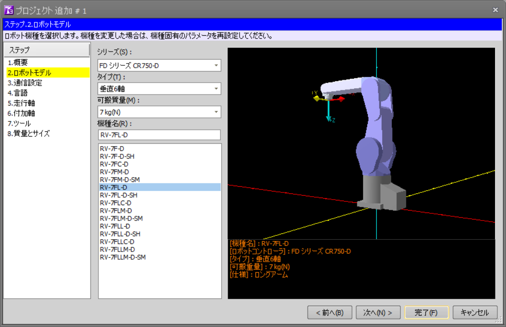
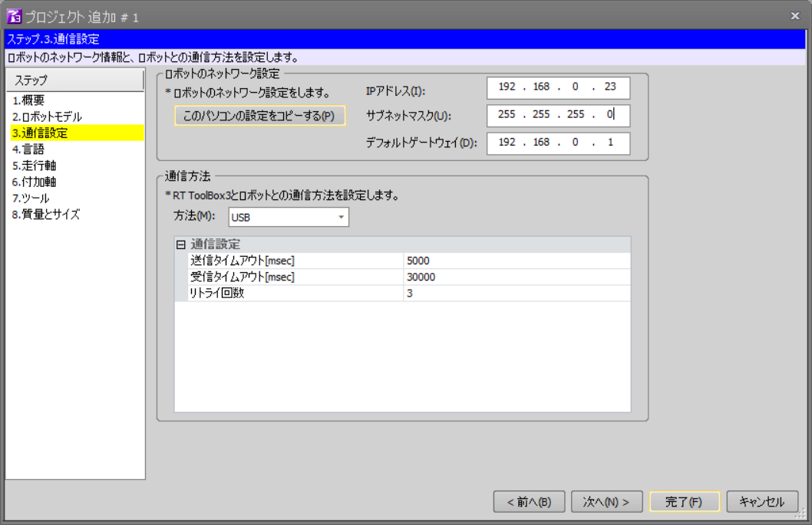

# 目的

この報告書では，三菱電機製産業ロボットアーム"RV-7FL"を対象として，ROS
化の実現可能性を調査した結果を報告する．「ROS化」とは，標準的マニュピ
レーションインターフェイスであるJointTrajectoryControllerおよびMoveIt!
を用いて実機を制御することである．Step1では，対象ロボットで
JointTrajectoryControllerが動作させることが可能かどうかを確認すること
が目的であり，ROS化そのものはStep2以降の作業となる．

# 構成

システムは，ロボットアーム側のコントローラ(以下ロボットコントローラと
呼ぶ)と，ROSの動作するPC(以下，ROS側PCと呼ぶ)で構成される．ロボットコ
ントローラとROS側PCは有線のEthernetで接続される．

ロボットコントローラとしてCR800およびCR750/751を用いる．これらは，イー
サネット経由で外部からの指令値を受け付ける「リアルタイム外部制御機能」
を持っている．

ROS側PCとしては，Ubuntu16.04とROS KineticをインストールしたIntel PCと
する．

# ロボットコントローラ側仕様

ここでは，「CR800, CR750/751シリーズコントローラ イーサネット機能 取扱
説明書(以下説明書）」から，関連する仕様をまとめる．

## リアルタイム外部制御機能

説明書3.3章の「リアルタイム外部機能」は，イーサネット(UDP)でロボットの
指令値を受け取り，ロボットの状態を返す機能である．ロボット内部では
7.1ms周期で制御ループが実行されており，外部からUDPパケットとして指令値
を受け取り，次の周期で現在の情報をUDPパケットとして返す．指令値は手先
の位置姿勢と，関節角度の2種類が選択できるが，ROS化ではIKをMoveIt!が行
うので関節角度指令のみ用いればよい．現在の情報としては，関節指令値，関
節角度，モータ電流などを選択できるが，最低限関節角度があればROS化は可
能である．

## リアルタイムモニタ機能

説明書3.3章の「リアルタイムモニタ機能」は，イーサネット(UDP)でロボット
の各種状態を外部へモニタ用に出力する機能である．ロボット自体や関節の情
報を取得するために用いることができる．

# ROSコントローラ側仕様

[ros_control](http://wiki.ros.org/ros_control)インターフェスに従ったコ
ントローラを想定する．`hardware_interface::RobotHW`を継承した
`MelfaHW`を作成し，初期化，終了処理と，周期ごとの処理を記述する．内部
では，関節の情報を`JointState`として出力するための
`JointStateInterface`と，関節の位置制御指令を受け付けるための
`PositionJointInterface`を用いる．`PositionJointInterface`を用いたイン
ターフェースにより関節角度の位置制御が可能になっていれば，
`JointTrajectoryAction`による関節角軌道の再生が可能なので，結果として
MoveIt!でのロボット動作がそのまま可能である．

# 検討項目と検証結果

## ロボットの状態を取得可能か

ロボットの状態を取得するために，ロボットコントローラのどの機能を用いる
べきかという検討項目である．

今回，ロボットの関節角度の取得に「リアルタイムモニタ機能」が必要かもし
れないと思われたが，「リアルタイム外部制御機能」で取得できる情報はパケッ
トごとに4種類を指定できるので，たとば関節角度と電流を両方取りたい場合
でも，リアルタイム外部制御機能でロボットの状態を取得可能である．

また，「リアルタイム外部制御機能」と「リアルタイムモニタ機能」のパケッ
ト処理は同期していないので，情報の取得にずれが生じることも考えられる．

以上の理由により，ロボットの制御周期ごとの状態が得られる「リアルタイム
外部制御機能」のみでROS化を実現することとした．

ただし，今後ロボットの他の状態を数多くリアルタイムにモニタリングしたい
場合には，この「リアルタイムモニタ機能」を使う必要がでてくるかもしれな
い．

## 通信途絶などの際の動作

コントローラとROS側PCは有線イーサネットで接続するが，ソフトウェアの停
止や経路の不具合で，通信が途絶することが考えられる．その場合の処理をど
のように行うかの検討項目である．

マニュアル，シミュレータおよび実機で確認したところ，ROS側PCからのUDPパ
ケットが途絶した場合に，コントローラ側では以下の2つの設定が可能である．

1. 次のパケットが到達するまで，最後に与えられた指令値へとサーボする
2. 一定時間パケットが到達しないとエラーとする

この内2の方法を採用すると，ロボットコントローラ側プログラムを起動すると，
ROS側のプログラムを起動する前にタイムアウトでエラーになってしまう．ROS
側のプログラムは，最初のパケットでロボットの現在角度を取得する必要があ
るので，先にロボット側プログラムを起動したい．

そのため，1の方法を採用することにした．この場合，ROS側PCからのパケット
が途絶した場合に急停止する．

## 実時間性能の確認

ROS側PCで実時間の定周期処理をする必要があるかという検討項目である．

ROS側PCは，一定周期でUDPパケットを送信することが求められるが，この周期
がCR750/751シリーズでは7msと短い．また，仮に周期が遅れてコントローラ側
の制御周期を飛ばしてしまった場合には，1周期分に渡って前の周期と同じ関
節角度指令値が用いられることになる．また，次の周期で連続性のない関節角
度指令値が送られてしまう．

これを防ぐためには，ROS側PCでリアルタイムOSを用い，必ず一定周期での処
理が行えるようにする必要があると思われる．リアルタイムOSとしてはLinux
カーネルを実時間化するREEMPT_RTパッチが有力である．

検証の結果，通常のLinuxカーネルでもそれほど頻繁に周期を守れないわけで
はないが，ROS側PCの計算負荷によっては問題になりうる頻度となるのではと
思われた．これはシミュレータのみで確認したが，シミュレータでは多少指令
値が不連続となっても見た目では気づきにくく，問題となるかは確認出来てい
ない．しかし実機では異音や異常停止の原因と思われるので，できれば避ける
べきと思われる．

検証の結果，LinuxのPREEMPT_RTパッチを適用したPCでは計算機負荷を上げて
も周期を守れなくなる現象は発生せず，安定した定周期処理が可能であること
が分かった．

# 動作確認コード

Step1では，ロボットコントローラの仕様に基づいて動作確認コードを作成し
た．動作確認コードでは，シミュレータ及びロボット実機において，以下の動
作を確認した．

- ROSのコマンドでロボットの現在の関節角度を表示する
- ROSのコマンドでロボットの関節を関節角制御角にて動作させる

# RT-ToolBox3によるROSコントローラの動作確認

## RT-ToolBox3の起動

RT-ToolBox3のアイコンをダブルクリックするなどして，RT-ToolBox3を起動す
る．起動すると，下図のような画面になる．


## 新規プロジェクトファイルの作成（最初のみ）

「新規作成」ボタンを押して，新規プロジェクトファイルを作成する．下図の
ようなウィザード画面になるので，「次」ボタンを押す．


「新規作成」ボタンを押して，新規プロジェクトファイルを作成する．下図の
ような画面になるので，「次へ」ボタンを押す．

「2.ロボットモデル」で下図のように，シリーズ「FDシリーズ CR750-D」，
機種名「RV-7FL-D」を選択する．「次へ」ボタンを押す．



「3．通信設定」で下図のように，PCのIPアドレスとゲートウェイアドレスを
入力する．「このパソコンの設定をコピーする」ボタンを使うと簡単に設定で
きる．この例では，`192.168.0.23`となっている．



あとはデフォルトの設定でいいので，「完了」ボタンを押して終了する．

## リアルタイム外部制御機能のプログラム作成（最初のみ）

説明書3.3章のサンプルプログラムを参考に，リアルタイム外部制御機能の指
令値を待ち受けるためのプログラムを作成する．

下図のように，「ワークスペース」内の「プログラム」フォルダ内に以下のプ
ログラムを作成し，`TEST1`と名づけて保存する．

```
Open "ENET:192.168.0.12" As #1
Mxt 1,1
End
```


この例では，ROS側PCのIPアドレスを `192.168.0.12`としている．これが実際
と違ってると通信が出来ないので注意する．

## シミュレーションモードへの移行

「ホーム」タブの「シミュレータ」ボタンを押して，シミュレーションモード
にする．下図のように，ロボットのパネルとロボットのモデルが表示される．


## プログラムの選択と実行

ロボットパネルの「プログラム：」の右にある「選択」ボタンを押して，
`TEST1`を選択する(すでに選択されていたら必要ない）．


ロボットのパネルの「実行」ボタンを押して，プログラムを実行する．

## ROSコントローラの起動

以下のようにして，ROSコントローラノードを起動する.robot_ipパラメータは，
シミュレータのPCのIPアドレスである．

```
$ roslaunch melfa_driver melfa_driver.launch robot_ip:=192.168.0.23 --screen
```

必要なROSのトピックが出力されていることを確認する．

```
$ rostopic list
```

/joint_statesに，現在の関節角度が出力されるので確認できる．

```
$ rostopic echo /joint_states
```

## rqtによるロボットの各軸制御

rqtのJointTrajctoryControllerプラグインを使うと，スライダでロボットの
各軸を操作できる．

```
$ rqt -s rqt_joint_trajectory_controller/JointTrajectoryController
```

として，rqtを起動する．`controller_manage_ns`と`controller`を選ぶと，
下図のようなスライダとなる．


中央のボタンを押すと緑色となり指令値の送信が開始される．スライダを動か
すと，RT-ToolBoxのシミュレーション画面のロボットの対応する軸の角度が操
作できる．

## 通信途絶時の挙動

ロボットシステムが動作時に，ROS側ノードを停止した場合，ロボットは最後
に受け取った角度指令値の姿勢で停止する．また，シミュレータ側のプログラ
ムを停止した場合，ROS側PCのノードはエラーを出力するので，Ctrl-Cで停止
して起動しなおせば問題は発生しないことが確認できる．

# ロボット実機による動作確認

以下は産総研のロボット実機による動作確認の手順である．

## RT-ToolBox2の起動

ロボットコントローラとネットワーク接続されている操作用PCにおいて，
RT-ToolBox2のアイコンをダブルクリックするなどして，RT-ToolBox2を起動す
る．ロボット実機と接続するための設定などは，すでに行われているため割愛
する．

操作用PCのIPアドレスを調べておく．IPアドレスはロボットコントローラと同
一のサプネット内にある．以下では仮に，シミュレータの場合と同じく
`192.168.0.23`であるとする．


## リアルタイム外部制御機能のプログラム作成(最初のみ)

リアルタイム外部制御機能の指令値を待ち受けるためのプログラムを作成する．
基本的にシミュレータ用のものと同じであるが，実機を動作させるので安全の
ために速度のオーバーライドコマンドを追加し，関節速度を最大速度の10%に
制限しておく．

「プログラム」フォルダ内に以下のプログラムを作成し，`ROS`と名づけて保
存する．

```
Ovrd 10
Open "ENET:192.168.0.12" As #1
Mxt 1,1
End
```

`192.168.0.12`はシミュレーションの場合と同じく，ROS側PCのIPアドレスで
ある．

### ロボットコントローラへのプログラム転送(最初のみ)

RT-ToolBoxをオンラインモードにし，ロボット実機と接続する．作成したプロ
グラムファイル`ROS`をロボットコントローラ側に転送する．通常のプログラ
ムの転送と同じなので詳細は割愛する．

### ロボットコントローラでのプログラム実行

ロボットコントローラのティーチングペンダントで，プログラム`ROS`を選択
する．サーボONし，プログラムを先頭から実行する．通常のプログラムの実行
と同じなので詳細は割愛する．

### ROSコントローラの起動

以下のROSコントローラノードの起動は，シミュレータの場合と全く同じであ
る．robot_ipパラメータをロボットコントローラのIPアドレスとし，以下のよ
うにroslaunchを実行する．

```
$ roslaunch melfa_driver melfa_driver.launch robot_ip:=192.168.0.23 --screen
```

必要なROSのトピックが出力されていることを確認する．

```
$ rostopic list
```

/joint_statesに，現在の関節角度が出力されるので確認できる．

```
$ rostopic echo /joint_states
```

### rqtによるロボットの各軸制御

rqtのJointTrajctoryControllerプラグインによりスライダでロボットの各軸
を操作できる．シミュレータの動作確認と同じなので，該当する章を参照のこ
と．

```
$ rqt -s rqt_joint_trajectory_controller/JointTrajectoryController
```

として，rqtを起動する．`controller_manage_ns`と`controller`を選ぶ．中
央のボタンを押すと緑色となり指令値の送信が開始される．スライダを動かす
と，RT-ToolBoxのシミュレーション画面のロボットの対応する軸の角度が操作
できる．

### 通信途絶時の挙動

ロボット実機でもシミュレータの場合と同様に，ROS側ノードを停止した場合，
ロボットは最後に受け取った角度指令値の姿勢で停止する．また，ロボットコ
ントローラ側のプログラムを停止した場合，ロボットはその場で停止し，ROS
側PCのノードはエラーを出力するのがCtrl-Cで終了でき，ロボットコントロー
ラを起動しなおせば，ROS側のノードも起動し直して動作の継続が可能である．

## PREEMPTRT_RTパッチによる実時間制御

ここまでは，通常のLinuxカーネルを用いている．実機においても通常のLinux
カーネルで特に問題が観測されるわけではないが，前述のように計算機負荷に
よっては問題となりうることが予想される．

以下では，PREEMPT_RTパッチを適用しての動作について解説する．

### PREEMPTRT_RTパッチを適用したカーネルのインストール

PREEMPTRT_RTパッチ適用の
[Wiki](https://wiki.linuxfoundation.org/realtime/documentation/howto/applications/preemptrt_setup)
の通りに，PREEMPT_RTパッチの適用とカーネルのビルドを行う．Step1におい
ては，バージョン 4.14.34-rt27を用いた．手順の概要は以下のコマンドとな
る．

```
$ wget https://www.kernel.org/pub/linux/kernel/v4.x/linux-4.14.34.tar.xz
$ wget https://www.kernel.org/pub/linux/kernel/projects/rt/4.14/patch-4.14.34-rt27.patch.xz
$ xz -cd linux-4.14.34.tar.xz | tar xvf -
$ cd linux-4.14.34
$ xzcat ../patch-4.14.34-rt27.patch.xz | patch -p1
$ make menuconfig
```

カーネル設定画面では，`Processor type and features`から`Preemption
Model`と進んで，`Fully Preemptible Kernel (RT)`を選択する．

最近はLinuxのMakefileにdeb-pkgターゲットがあるので，make-kpkgは使わな
い方向になっている．

```
$ make deb-pkg
```

以下のdebファイルが生成される．

```
linux-headers-4.14.34-rt27_4.14.34-rt27-3_amd64.deb
linux-image-4.14.34-rt27_4.14.34-rt27-3_amd64.deb
```

dpkgを用いてインストールする．

```
$ sudo dpkg -i linux-image-4.14.34-rt27_4.14.34-rt27-3_amd64.deb linux-headers-4.14.34-rt27_4.14.34-rt27-3_amd64.deb
```

ユーザ権限でリアルタイム処理が動くように，/etc/security/limits.confに
各種制限を解除する設定を追加し，リブートする．

```
* - rtprio 99
* - nice -10
* - memlock unlimited
```

リブート後，以下のコマンドで一般ユーザでも各種制限が解除されていること
を確認する．

```
$ ulimit -a

# こうなっていればOK
...
max locked memory       (kbytes, -l) unlimited
...
real-time priority      (-r) 99
...

```

## リアルタイム性の検証

### 周期の測定

ノードが定周期処理を行っているかは，`/diagnotics`トピックに出力される
ようになっている．これを見るためには，rqtのプラグイン"Runtime Monitor"
を用いると便利である．"Runtime Monitor"はrqtのプラグインメニューから
"Robot Tools"->"Runtime Monitor"と選択する．図のような画面となる．


### 計算負荷をかける

ROS側PCに計算負荷をかけるには，`stress`コマンドを使う．他の端末を開き，

```
$ stress -c 100
```

と実行すると，100個のプロセスでsqrt計算を行うために計算負荷が大幅に増
大する．このとき，Runtime Monitorには，周期を超過した際に表示される警
告がかなりの頻度で表示され，ノード処理の定周期が守られないことが分かる．


### リアルタイムプロセスとしての実行

リアルタイムカーネルで`melfa_driver_node`をリアルタイムプロセスとして
実行するには，以下のように`roslaunch`に引数`realtime`を設定する．

```
$ roslaunch melfa_driver melfa_driver.launch robot_ip:=192.168.0.23 realtime:=true --screen
```

この際，同様に`stress`コマンドで計算機負荷を増大させても，周期超過の警
告が出ないことが確認できる．

## 結論

以上の検討と，動作確認コードによる検証により，対象ロボットアームおよび
コントローラのROS対応は可能であると結論付けられる．

