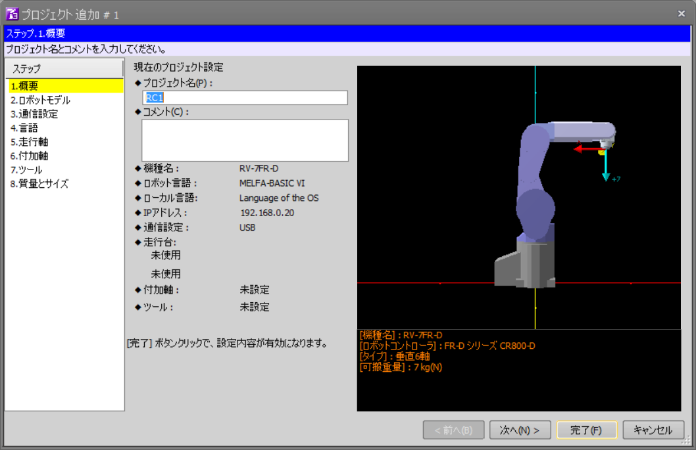

# 産業ロボットアームRV-7FL ROS化調査作業 報告書

## 目的

この報告書では，三菱電機製産業ロボットアーム"RV-7FL"を対象として，ROS
化の可能性を調査した結果を報告する．「ROS化」とは，標準的マニュピレー
ションインターフェイスであるJointTrajectoryControllerおよびMoveIt!を用
いて実機を制御することである．

## 構成

システムは，ロボットアーム側のコントローラ(以下ロボットコントローラと
呼ぶ)と，ROSの動作するPC(以下，ROS側PCと呼ぶ)で構成される．ロボットコ
ントローラとROS側は有線のEthernetで接続される．

ロボットコントローラとしてCR800およびCR750/751を用いる．これらは，イー
サネット経由で外部からの指令値を受け付ける「リアルタイム外部制御機能」
を持っている．

ROS側PCとしては，Ubuntu16.04とROS Kineticをインストールした任意のIntel
PCとする．

### 動作確認コードの受入検査

4.2 「コントローラ側の前提」，4.4 「動作確認プログラムで確認すべき項目，
および，懸念される項目」の条件を満たしROSコントローラからの動作が可能
であると判明した場合のみ行う。

シミュレータ上で，

- ROSのコマンドでロボットの関節を関節角制御角にて動作させる
- ROSのコマンドでロボットの現在の関節角度を表示する

ロボット実機上で，

- ROSのコマンドでロボットの関節を関節角制御角にて動作させる
- ROSのコマンドでロボットの現在の関節角度を表示する

## ロボットコントローラ側仕様

ここでは，CR800, CR750/751シリーズコントローラ イーサネット機能 取扱説
明書(以下説明書）から，関連する仕様をまとめる．

### リアルタイム外部制御機能

説明書3.3章の「リアルタイム外部機能」は，イーサネット(UDP)でロボットの
指令値を受け取り，ロボットの状態を返す機能である．

### リアルタイムモニタ機能


## ROSコントローラ側仕様

## 検討項目と，予想される問題点

### 実時間性能の確認

周期 < 10msでUDPパケットを投げるためのPC(ROS)側の実時間性能の確認

### ロボットの状態を取得可能か

「リアルタイムモニタ機能」が「リアルタイム外部制御機能」と同時に使用可
能性の評価もしモニタ機能が使えない場合、「リアルタイム外部制御機能」で
取得できる情報はパケットごとに１種類なので，たとば関節角度と電流を両方
取りたい場合は，周期が２倍になるが性能的に可能か？「リアルタイムモニタ
機能」のパケットと「リアルタイム外部制御機能」のパケットは同期していな
いが、その場合でも性能上問題は無いか？

### 通信途絶などの際の動作

ROS側からの通信が途絶えた場合など、コントローラ側の挙動が不明だが、安
全に動作が可能か？

## RT-ToolBox3によるROSコントローラの動作確認

### RT-ToolBox3の起動

RT-ToolBox3のアイコンをダブルクリックするなどして，RT-ToolBox3を起動す
る．起動すると，下図のような画面になる．


### 新規プロジェクトファイルの作成（最初のみ）

「新規作成」ボタンを押して，新規プロジェクトファイルを作成する．下図の
ようなウィザード画面になるので，「次」ボタンを押す．




「新規作成」ボタンを押して，新規プロジェクトファイルを作成する．下図の
ような画面になるので，「次へ」ボタンを押す．

「2.ロボットモデル」で下図のように，シリーズ「FDシリーズ CR750-D」，
機種名「RV-7FL-D」を選択する．（仕様では対応機種が「RV-7FL」となっていた
のでこうしているが，もしかしたら違うかも知れない）「次へ」ボタンを押す．


「3．通信設定」で下図のように，PCのIPアドレスとゲートウェイアドレスを
入力する．「このパソコンの設定をコピーする」ボタンを使うと簡単に設定で
きる．この例では，`192.168.0.21`となっている．


あとはデフォルトの設定でいいので，「完了」ボタンを押して終了する．

### リアルタイム外部制御機能のプログラム作成（最初のみ）

説明書3.3章のサンプルプログラムを参考に，リアルタイム外部制御機能の指
令値を待ち受けるためのプログラムを作成する．

下図のように，「ワークスペース」内の「プログラム」フォルダ内に以下のプ
ログラムを作成し，`TEST1`と名づけて保存する．

```
Open "ENET:192.168.0.12" As #1
Mxt 1,1
End
```


この例では，ROS側PCのIPアドレスを `192.168.0.12`としている．これが実際
と違ってると通信が出来ないので注意する．

### シミュレーションモードへの移行

「ホーム」タブの「シミュレータ」ボタンを押して，シミュレーションモード
にする．下図のように，ロボットのパネルとロボットのモデルが表示される．


### プログラムの選択と実行

ロボットパネルの「プログラム：」の右にある「選択」ボタンを押して，
`TEST1`を選択する(すでに選択されていたら必要ない）．


ロボットのパネルの「実行」ボタンを押して，プログラムを実行する．

### ROSコントローラの起動

以下のようにして，ROSコントローラノードを起動する．

```
$ roslaunch melfa_driver melfa_driver.launch robot_ip:=192.168.0.21 --screen
```

必要なROSのトピックが出力されていることを確認する．

```
$ rostopic list
```

/joint_statesに，現在の関節角度が出力されるので確認できる．

```
$ rostopic echo /joint_states
```

### rqtによるロボットの各軸制御

rqtのJointTrajctoryControllerプラグインを使うと，スライダでロボットの
各軸を操作できる．

```
$ rqt -s rqt_joint_trajectory_controller/JointTrajectoryController
```

として，rqtを起動する．`controller_manage_ns`と`controller`を選ぶと，
下図のようなスライダとなる．


中央のボタンを押すと緑色となり指令値の送信が開始される．スライダを動か
すと，RT-ToolBoxのシミュレーション画面のロボットの対応する軸の角度が操
作できる．
