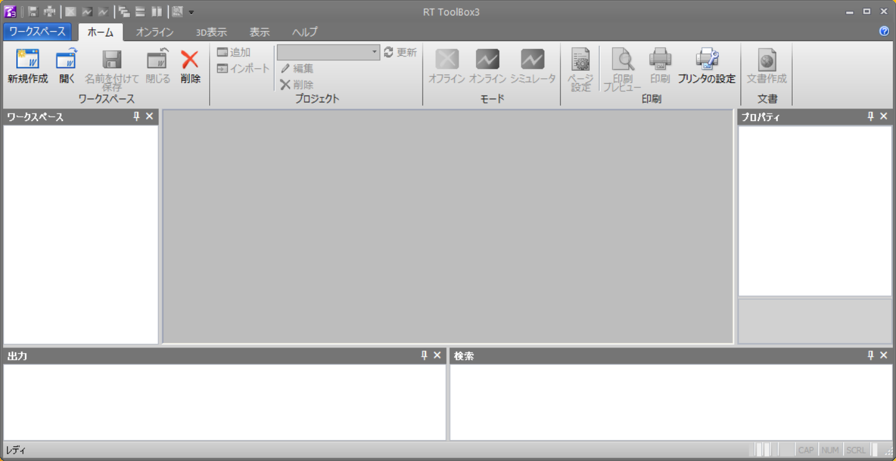
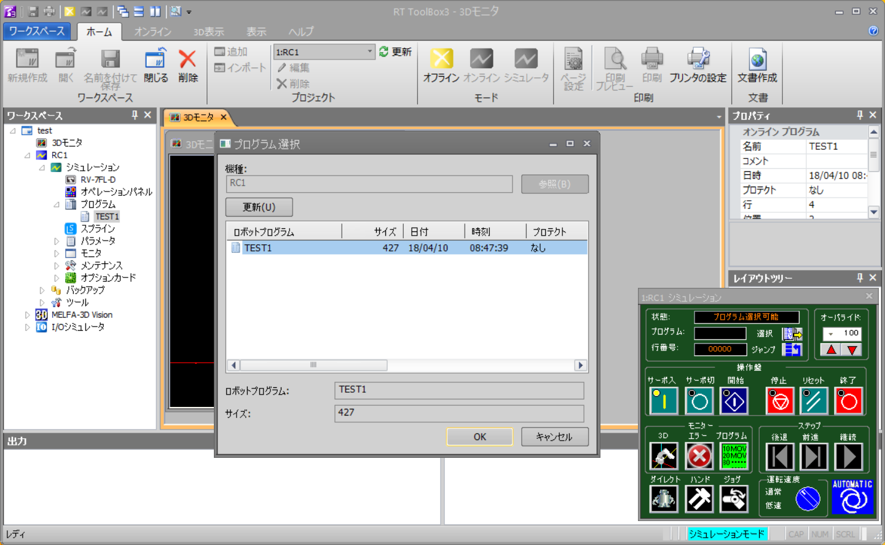

# 目的

この報告書では，三菱電機製産業用ロボットアーム"RV-7FL"を対象として，
ROS化の実現可能性を調査した結果を報告する．「ROS化」とは，標準的マニュ
ピレーションインターフェイスであるJointTrajectoryControllerおよび
MoveIt! を用いて実機を制御することである．Step1では，対象ロボットで
JointTrajectoryControllerが動作させることが可能かどうかを確認すること
が目的であり，ROS化そのものはStep2以降の作業となる．


システムはロボットアーム側のコントローラ(以下ロボットコントローラと
呼ぶ)と，ROSの動作するPC(以下，ROS側PCと呼ぶ)で構成される．ロボットコ
ントローラとROS側PCは有線のEthernetで接続される．

ロボットコントローラとしてCR800およびCR750/751を用いる．これらは，イー
サネット経由で外部からの指令値を受け付ける「リアルタイム外部制御機能」
を持っている．


ROS側PCとしては，Ubuntu16.04とROS KineticをインストールしたIntel PCと
する．今回の動作確認には，Lenovo Thinkpad Carbon X1(2017モデル)を用い
た．

# ロボットコントローラ側仕様

ここでは，「CR800, CR750/751シリーズコントローラ イーサネット機能 取扱
説明書(以下説明書）」から，関連する仕様をまとめる．

## リアルタイム外部制御機能

説明書3.3章の「リアルタイム外部機能」は，イーサネット(UDP)でロボットの
指令値を受け取り，ロボットの状態を返す機能である．ロボット内部では
7.1ms周期で制御ループが実行されており，外部からUDPパケットとして指令値
を受け取り，次の周期で現在の情報をUDPパケットとして返す．指令値は手先
の位置姿勢と，関節角度の2種類が選択できるが，ROS化ではIKをMoveIt!が行
うので関節角度指令のみ用いればよい．現在の情報としては，関節指令値，関
節角度，モータ電流などを選択できるが，最低限関節角度があればROS化は可
能である．

## リアルタイムモニタ機能

説明書3.3章の「リアルタイムモニタ機能」は，イーサネット(UDP)でロボット
の各種状態を外部へモニタ用に出力する機能である．ロボット自体や関節の情
報を取得するために用いることができる．

# ROSコントローラ側仕様

ros_controlインターフェスに従ったコントローラを想定する．

- [ros_control - http://wiki.ros.org/ros_control](http://wiki.ros.org/ros_control)

`hardware_interface::RobotHW`を継承した`MelfaHW`を作成し，初期化，終了
処理と，周期ごとの処理を記述する．内部では，関節の情報を`JointState`と
して出力するための`JointStateInterface`と，関節の位置制御指令を受け付
けるための`PositionJointInterface`を用いる．`PositionJointInterface`を
用いたインターフェースにより関節角度の位置制御が可能になっていれば，
`JointTrajectoryAction`による関節角軌道の再生が可能なので，結果として
MoveIt!でのロボット動作がそのまま可能である．

# 検討項目と検討結果

## ロボットの状態の取得方法

ロボットの状態を取得するために，ロボットコントローラのどの機能を用いる
べきかという検討項目である．

今回，ロボットの関節角度の取得に「リアルタイムモニタ機能」が必要かもし
れないと思われたが，「リアルタイム外部制御機能」で取得できる情報はパケッ
トごとに4種類を指定できるので，たとば関節角度と電流を両方取りたい場合
でも，リアルタイム外部制御機能でロボットの状態を取得可能である．

また，「リアルタイム外部制御機能」と「リアルタイムモニタ機能」のパケッ
ト処理は同期していないので，情報の取得にずれが生じることも考えられ，制
御のためには「リアルタイムモニタ機能」はできるだけ使用を避けたほうが良
い．ただし，今後ロボットの他の状態を数多くリアルタイムにモニタリングし
たい場合には，この「リアルタイムモニタ機能」を使う必要がでてくるかもし
れない．

以上の理由により，ロボットの制御周期ごとの状態が得られる「リアルタイム
外部制御機能」のみでROS化を実現することとした．

## 通信途絶などの際の動作

コントローラとROS側PCは有線イーサネットで接続するが，ソフトウェアの停
止や経路の不具合で，通信が途絶することが考えられる．その場合の処理をど
のように行うかの検討項目である．

マニュアル，シミュレータで確認したところ，ROS側PCからのUDPパケットが途
絶した場合に，コントローラ側では以下の2つの設定が可能である．

1. 次のパケットが到達するまで，最後に与えられた指令値へとサーボする
2. 一定時間パケットが到達しないとエラーとする

この内,2の方法を採用すると，ロボットコントローラ側プログラムを起動する
と，ROS側のプログラムを起動する前にタイムアウトでエラーになってしまう．
ROS側のプログラムは，最初のパケットでロボットの現在角度を取得する必要
があるので，先にロボットコントローラ側のプログラムを起動したい．

そのため，1の方法を採用することにした．この場合，ROS側PCからのパケット
が途絶した場合に急停止するが，産業用ロボットのエラー時の標準的な挙動で
あり，問題は無いと思われる．

## 実時間性能の確認

ROS側PCで実時間の定周期処理をする必要があるかという検討項目である．

ROS側PCは一定周期でUDPパケットを送信することが求められるが，この周期が
CR750/751シリーズでは7ms,CR800シリーズでは3.5msと短い．また，仮に周期
が遅れてコントローラ側の制御周期を飛ばしてしまった場合には，1周期分に
渡って前の周期と同じ関節角度指令値が用いられ，次の周期で連続性のない関
節角度指令値が送られてしまう．これは，ロボットの動作中の異音や異常停止
の原因になりうることが予想できる．

これを防ぐためには，一つはロボットコントローラ側に指令値のバッファを設
け，ある程度の時間は指令値が来ないことを許容させる方法が考えられる．し
かし，説明書を読む限り指令値に対するバッファは設定されておらず設定する
方法もないため，この方法は採れない．

もう一つはROS側PCでリアルタイムOSを用い，必ず一定周期での処理が行える
ようにする方法がある．リアルタイムOSとしてはLinuxカーネルを実時間化す
るREEMPT_RTパッチが有力である．通常のLinuxカーネルでもそれほど頻繁に周
期を守れないわけではないが，ROS側PCの計算負荷によっては問題になりうる
頻度となる．シミュレータでは多少指令値が不連続となっても見た目では気づ
きにくく，問題となるかは確認が難しい．しかし実機では異音や異常停止の原
因と思われるので，できれば避けるべきである．

検証の結果，LinuxのPREEMPT_RTパッチを適用したPCでは計算機負荷を上げて
も周期を守れなくなる現象は発生せず，安定した定周期処理が可能であること
が分かった．詳細については後述する．

# 動作確認コード

Step1では，ロボットコントローラの仕様に基づいて動作確認コードを作成し
た．動作確認コードでは，シミュレータ及びロボット実機において，以下の動
作を確認した．

- ROSのコマンドでロボットの現在の関節角度を表示する
- ROSのコマンドでロボットの関節を関節角制御角にて動作させる

動作確認コードは，以下の2つのROSパッケージからなる．

- melfa_driver
- melfa_description

## melfa_driver

ロボットコントローラ側プログラムと通信し，関節角指令値を与えるドライバ
ノード(`melfa_driver_node`)や，動作確認のためにシステムを起動するため
のlaunchファイル(`melfa_driver.launch`）を含む．

## melfa_description

ロボットの運動学的なモデルを記述したURDFファイル(`rv7fl.urdf.xacro`)を
含む．

# RT-ToolBox3によるROSコントローラの動作確認

シミュレータRT-ToolBox3での動作確認の手順について以下に示す．

## RT-ToolBox3の起動

RT-ToolBox3のアイコンをダブルクリックするなどして，RT-ToolBox3を起動す
る．起動すると，下図のような画面になる．



## 新規プロジェクトファイルの作成(最初のみ)

「新規作成」ボタンを押して，新規プロジェクトファイルを作成する．下図の
ようなウィザード画面になるので，「次」ボタンを押す．


「新規作成」ボタンを押して，新規プロジェクトファイルを作成する．下図の
ような画面になるので，「次へ」ボタンを押す．

「2.ロボットモデル」で下図のように，シリーズ「FDシリーズ CR750-D」，
機種名「RV-7FL-D」を選択する．「次へ」ボタンを押す．


「3．通信設定」で下図のように，PCのIPアドレスとゲートウェイアドレスを
入力する．「このパソコンの設定をコピーする」ボタンを使うと簡単に設定で
きる．この例では，`192.168.0.23`となっている．


あとはデフォルトの設定でいいので，「完了」ボタンを押して終了する．

## リアルタイム外部制御機能のプログラム作成(最初のみ)

説明書3.3章のサンプルプログラムを参考に，リアルタイム外部制御機能の指
令値を待ち受けるためのプログラムを作成する．

下図のように，「ワークスペース」内の「プログラム」フォルダ内に以下のプ
ログラムを作成し，名前をつけて保存する．

```
Open "ENET:192.168.0.12" As #1
Mxt 1,1
End
```


この例では，ROS側PCのIPアドレスを `192.168.0.12`としている．これが実際
と違ってると通信が出来ないので注意する．

## シミュレーションモードへの移行

「ホーム」タブの「シミュレータ」ボタンを押して，シミュレーションモード
にする．下図のように，ロボットのパネルとロボットのモデルが表示される．


## プログラムの選択と実行

ロボットパネルの「プログラム：」の右にある「選択」ボタンを押して，先ほ
どのプログラムを選択する(すでに選択されていたら必要ない）．



ロボットのパネルの「実行」ボタンを押して，プログラムを実行する．

## ROSコントローラの起動

以下のようにして，ROSコントローラノードを起動する.`robot_ip`パラメータ
は，シミュレータが動作するPCのIPアドレスである．

```
$ roslaunch melfa_driver melfa_driver.launch \
                      robot_ip:=192.168.0.23 --screen
```

必要なROSのトピックが出力されていることを確認する．

```
$ rostopic list
```

現在の関節角度が/joint_statesの`position`フィールドに出力されることが
確認できる．角度の単位はラジアンである．

```
$ rostopic echo /joint_states
...
---
header: 
  seq: 9080
  stamp: 
    secs: 1526537101
    nsecs: 872130975
  frame_id: ''
name: [joint1, joint2, joint3, joint4, joint5, joint6, joint7, joint8]
position: [-1.6251775026321411, 0.6110450029373169, \
0.7936335206031799, -0.10183798521757126, 1.5005848407745361, \
0.2562006115913391, 415.5789489746094, 0.0]
velocity: [3.4267326e-317, 2.266473e-317, 3.4267326e-317, \
6.9165478677987e-310, 1e-323, 3.427326e-317, \
6.95308309577386e-310, 2.3243956e-317]
effort: [0.0, 2.1220281696e-314, 0.0, 1.8644563579047727e-243, \
6.95308309577465e-310, 2.324472e-317, 1.5e-323, 2.340257e-317]
---
...
```

## rqtによるロボットの各軸制御

rqtのJointTrajctoryControllerプラグインを使うと，スライダでロボットの
各軸を操作できる．

```
$ rqt -s rqt_joint_trajectory_controller/JointTrajectoryController
```

として，rqtを起動する．`controller_manage_ns`と`controller`を選ぶと，
下図のようなスライダとなる．


中央のボタンを押すと緑色となり指令値の送信が開始される．スライダを動か
すと，RT-ToolBoxのシミュレーション画面のロボットの対応する軸の角度が操
作できる．

## 通信途絶時の挙動

ロボットシステムが動作時に，ROS側ノードを停止した場合，ロボットは最後
に受け取った角度指令値の姿勢で停止する．また，シミュレータ側のプログラ
ムを停止した場合，ROS側PCのノードはエラーを出力するので，Ctrl-Cで停止
して，シミュレータ側,ROS側プログラムの順で起動しなおせば問題は発生しな
いことが確認できる．

# ロボット実機による動作確認

以下は動作確認に用いたロボット実機(産総研)による動作確認の手順である．

## RT-ToolBox2の起動

ロボットコントローラとネットワーク接続されている操作用PCにおいて，
RT-ToolBox2のアイコンをダブルクリックするなどして，RT-ToolBox2を起動す
る．ロボット実機と接続するための設定などは，産総研にてすでに行われてい
るため割愛する．

操作用PCのIPアドレスを調べておく．IPアドレスはロボットコントローラと同
一のサブネット内にある．以下では仮に，シミュレータの場合と同じく
`192.168.0.23`であるとする．

## リアルタイム外部制御機能のプログラム作成(最初のみ)

リアルタイム外部制御機能の指令値を待ち受けるためのプログラムを作成する．
基本的にシミュレータ用のものと同じであるが，実機を動作させるので安全の
ために速度のオーバーライドコマンドを追加し，関節速度を最大速度の10%に
制限しておく．

「プログラム」フォルダ内に以下のプログラムを作成し，名前をつけて保存す
る．

```
Ovrd 10
Open "ENET:192.168.0.12" As #1
Mxt 1,1
End
```

`192.168.0.12`はシミュレーションの場合と同じく，ROS側PCのIPアドレスで
ある．

## ロボットコントローラへのプログラム転送(最初のみ)

RT-ToolBoxをオンラインモードにし，ロボット実機と接続する．作成したプロ
グラムファイルをロボットコントローラ側に転送する．通常のプログラムの転
送と同じなので詳細は割愛する．

## ロボットコントローラでのプログラム実行

ロボットコントローラのティーチングペンダントで，作成したプログラムを選
択する．サーボONし，プログラムを先頭から実行する．通常のプログラムの実
行と同じなので詳細は割愛する．

## ROSコントローラの起動

以下のROSコントローラノードの起動は，シミュレータの場合と全く同じであ
る．`robot_ip`パラメータをロボットコントローラのIPアドレスとし，以下の
ように`roslaunch`を実行する．

```
$ roslaunch melfa_driver melfa_driver.launch \
                       robot_ip:=192.168.0.23 --screen
```

必要なROSのトピックが出力されていることを確認する．

```
$ rostopic list
```

/joint_statesに，現在の関節角度が出力されるので確認できる．

```
$ rostopic echo /joint_states
```

## rqtによるロボットの各軸制御

rqtのJointTrajctoryControllerプラグインによりスライダでロボットの各軸
を操作できる．シミュレータの動作確認と同じなので，該当する章を参照のこ
と．

```
$ rqt -s rqt_joint_trajectory_controller/JointTrajectoryController
```

として，rqtを起動する．`controller_manage_ns`と`controller`を選ぶ．中
央のボタンを押すと緑色となり指令値の送信が開始される．スライダを動かす
と，RT-ToolBoxのシミュレーション画面のロボットの対応する軸の角度が操作
できる．

## 通信途絶時の挙動

シミューレションの場合と同様であり，問題は発生しないことが確認できる．

## 実機確認時のトラブル

当初ロボットは6軸を想定していたため，6軸分の処理のみを行っていた．動作
確認時の実機は7軸目として直動軸が追加されており，この部分への指令値が
当初は0となっていたため，実機実行時にエラーとなった．

ロボットコントローラの仕様としては8軸分の情報が確保されているので，動
作確認コードの軸数を8軸に拡張した．その際，実際には2軸分定義されていな
い関節があると警告メッセージが表示されるため，ROSのロボットモデル
(URDF)に，実際には無いダミーの2軸(joint7, joint8)を定義することで警告
を回避した．

実際のROSノードではロボットの実際の軸の一覧をパラメータ(rosparam)とし
て与えるようにしておけば問題は無いと思われる．

# リアルタイム性の検証

ここまでは，通常のLinuxカーネルを用いている．実機においても通常のLinux
カーネルで特に問題が観測されたわけではないが，前述のように計算機負荷に
よっては問題となりうることが予想される．

以下では，PREEMPT_RTパッチを適用しての動作について解説する．

## PREEMPTRT_RTパッチを適用したカーネルのインストール

PREEMPTRT_RT パッチ適用のWikiの通りに，PREEMPT_RTパッチの適用とカーネ
ルのビルドを行う．

- [Wiki - https://wiki.linuxfoundation.org/realtime/documentation/howto/applications/preemptrt_setup](https://wiki.linuxfoundation.org/realtime/documentation/howto/applications/preemptrt_setup)

Step1においては，バージョン 4.14.34-rt27を用いた．手
順の概要は以下のコマンドとなる．

```
$ wget https://www.kernel.org/pub/linux/kernel/v4.x/linux-4.14.34.tar.xz
$ wget https://www.kernel.org/pub/linux/kernel/projects/rt/4.14/ \
                                             patch-4.14.34-rt27.patch.xz
$ xz -cd linux-4.14.34.tar.xz | tar xvf -
$ cd linux-4.14.34
$ xzcat ../patch-4.14.34-rt27.patch.xz | patch -p1
$ make menuconfig
```

カーネル設定画面では，`Processor type and features`から`Preemption
Model`と進んで，`Fully Preemptible Kernel (RT)`を選択する．

最近はLinuxのMakefileにdeb-pkgターゲットがあるので，make-kpkgは使わな
い方向になっている．

```
$ make deb-pkg
```

以下のdebファイルが生成される．

```
linux-headers-4.14.34-rt27_4.14.34-rt27-3_amd64.deb
linux-image-4.14.34-rt27_4.14.34-rt27-3_amd64.deb
```

dpkgを用いてインストールする．

```
$ sudo dpkg -i linux-image-4.14.34-rt27_4.14.34-rt27-3_amd64.deb \
                 linux-headers-4.14.34-rt27_4.14.34-rt27-3_amd64.deb
```

ユーザ権限でリアルタイム処理が動くように，/etc/security/limits.confに
各種制限を解除する設定を追加し，リブートする．

```
* - rtprio 99
* - nice -10
* - memlock unlimited
```

リブート後，以下のコマンドで一般ユーザでも各種制限が解除されていること
を確認する．

```
$ ulimit -a

# こうなっていればOK
...
max locked memory       (kbytes, -l) unlimited
...
real-time priority      (-r) 99
...

```

## 周期の測定

ノードが定周期処理を行っているかは，`/diagnotics`トピックに出力される
ようになっている．これを見るためには，rqtのプラグイン"Runtime Monitor"
を用いると便利である．"Runtime Monitor"はrqtのプラグインメニューから
"Robot Tools"->"Runtime Monitor"と選択する．図のような画面となる．


## 計算負荷をかける

ROS側PCに計算負荷をかけるには，`stress`コマンドを使う．他の端末を開き，

```
$ stress -c 100
```

と実行すると，100個のプロセスでsqrt計算を行うために計算負荷が大幅に増
大する．このとき，Runtime Monitorには，周期を超過した際に表示される警
告がかなりの頻度で表示され，ノード処理の定周期が守られないことが分かる．


### リアルタイムプロセスとしての実行

リアルタイムカーネルで`melfa_driver_node`をリアルタイムプロセスとして
実行するには，以下のように`roslaunch`に引数`realtime`を設定する．

```
$ roslaunch melfa_driver melfa_driver.launch \
                   robot_ip:=192.168.0.23 realtime:=true --screen
```

この際，同様に`stress`コマンドで計算機負荷を増大させても，周期超過の警
告が出ないことが確認できる．

# 結論

以上の検討と動作確認コードによる検証により，対象ロボットアームおよびコ
ントローラのROS対応は問題なく可能であると結論付けられる．

